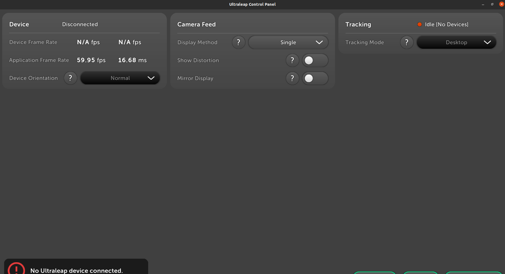
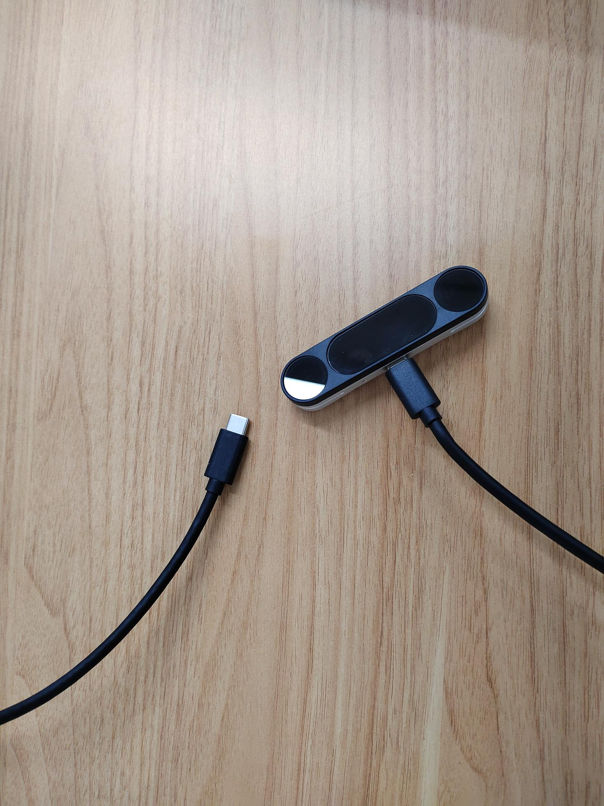
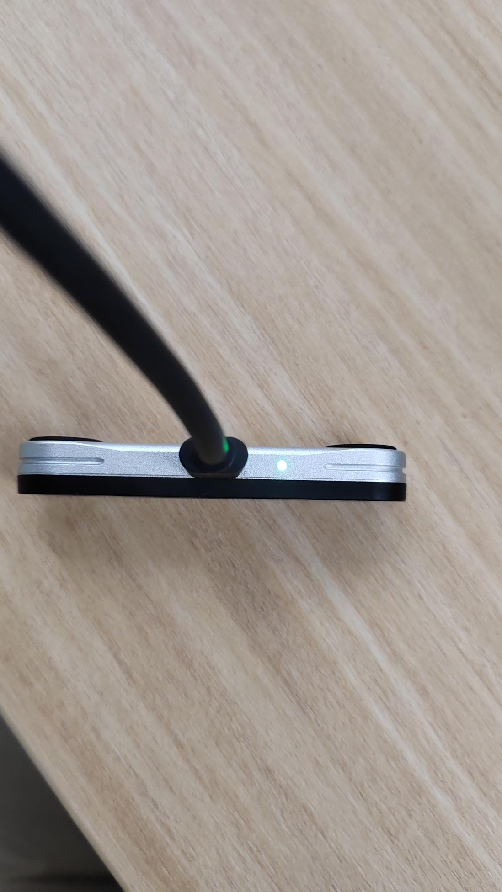
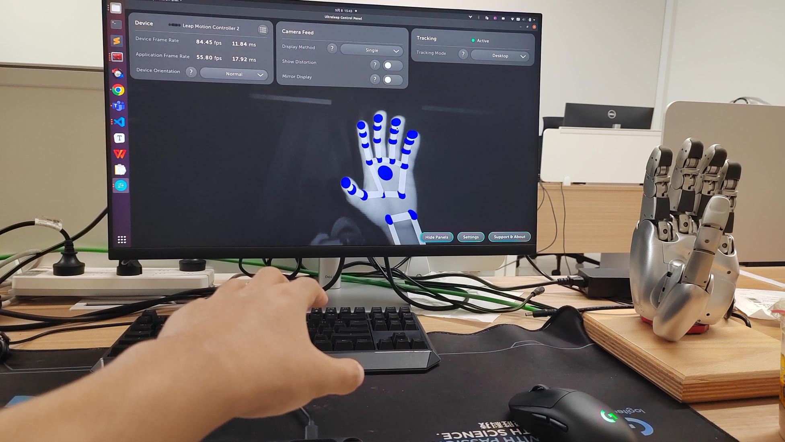
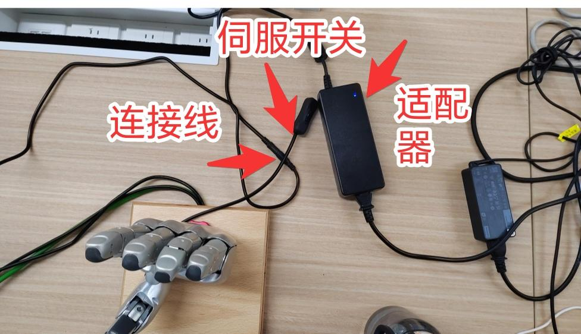
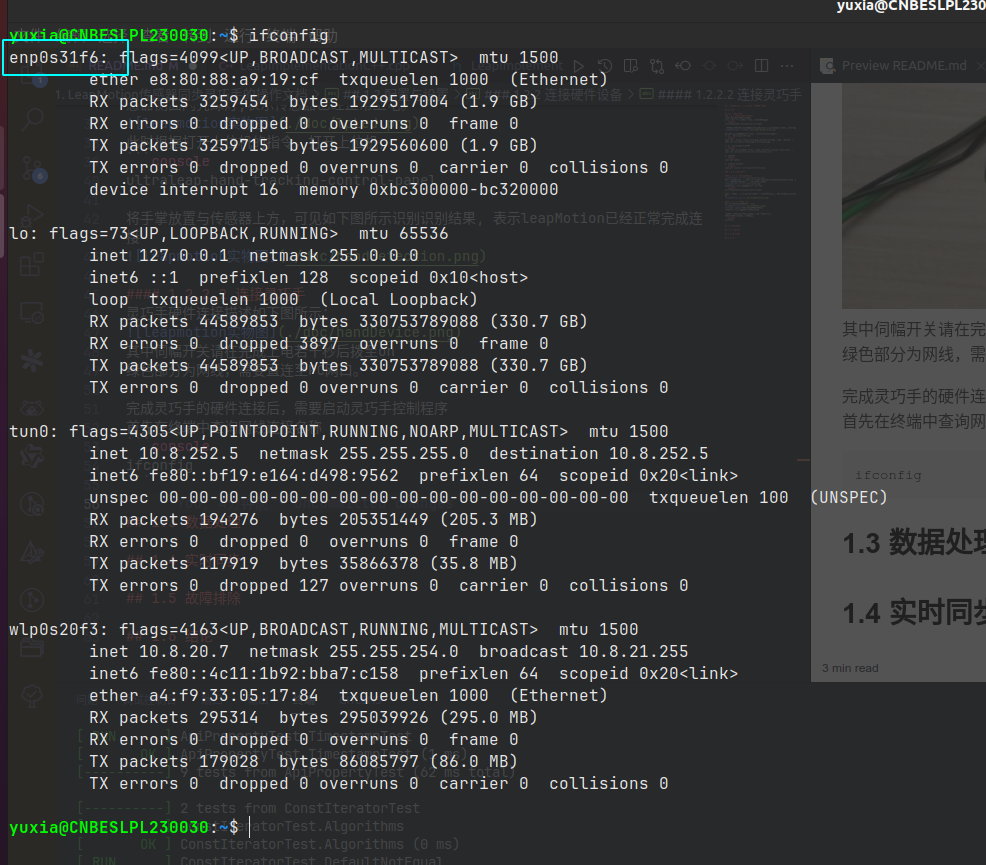
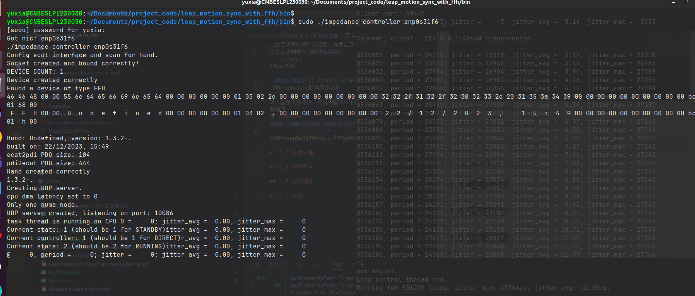
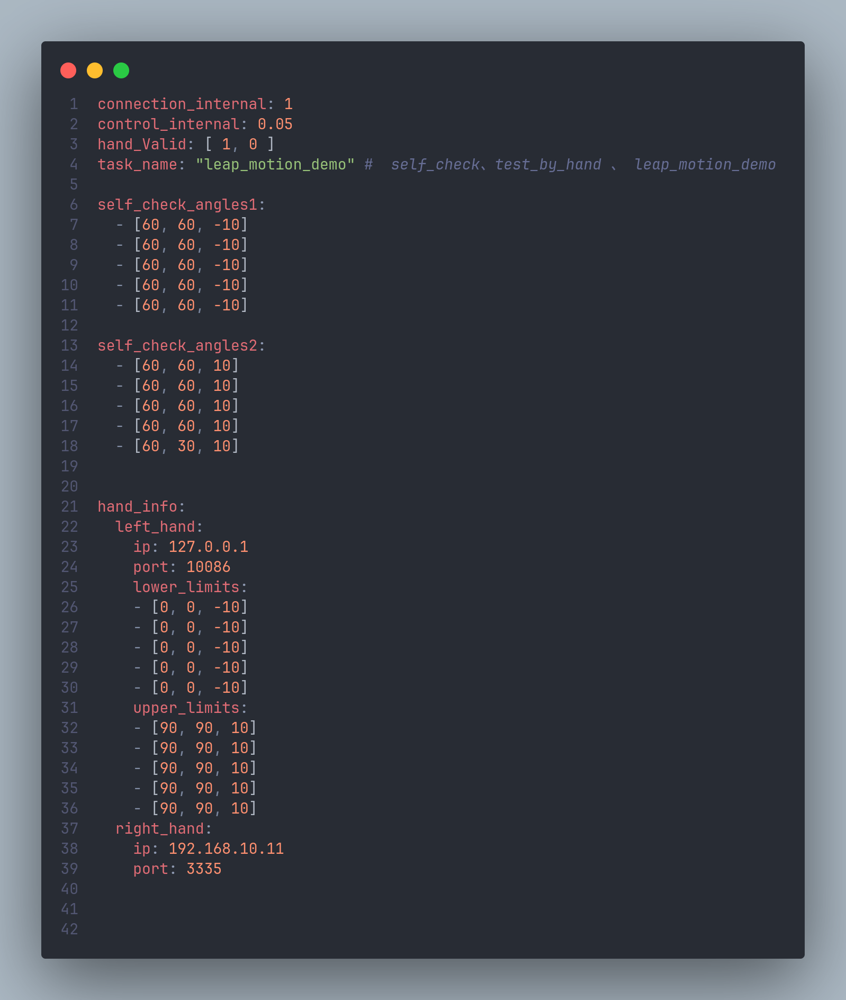

# LeapMotion传感器同步灵巧手的操作文档

## 1 引言
该文档用于描述LeapMotion传感器数据实时同步至灵巧手的应用描述文档。
其中LeapMotion为一款高精度的手势识别设备，这款设备允许用户通过自然手势与计算机交互，无需接触任何物理设备。LeapMotion传感器通过一对红外摄像头捕捉手部和手指的动作，能够以非常高的精度跟踪手部在三维空间中的细微移动。
灵巧手可由通过UDP网络通信实现灵巧手五个手指的指尖、指中以及侧摆关节的运动控制。

## 2 配置与设置
### 2.1 安装LeapMotion驱动
测试是否安装LeapMotion驱动
ctrl + alt + T 按键打开命令行，输入如下指令
```console
ultraleap-hand-tracking-control-panel
```
出现如下界面后表示已经成功安装LeapMotion在linux下的驱动，可跳转至下个章节


如果驱动未安装成功，则在命令行中根据以下命令安装驱动
1) 添加 Ultraleap GPG Key:
```console
wget -qO - https://repo.ultraleap.com/keys/apt/gpg | gpg --dearmor | sudo tee /etc/apt/trusted.gpg.d/ultraleap.gpg
```
2) 添加Ultraleap仓库至APT:
```console
echo 'deb [arch=amd64] https://repo.ultraleap.com/apt stable main' | sudo tee /etc/apt/sources.list.d/ultraleap.list
```
3) 更新APT
```console
sudo apt update
```   
4) 安装Ultraleap包
```console
sudo apt install ultraleap-hand-tracking
```   
### 2.2 连接硬件设备

#### 2.2.1 连接leapMotion

如图为leapMotion传感器的实物图，将其typec接口插入PC的typec接口，等待几秒后，传感器侧面闪亮绿灯,表示传感器已经正常上电。

此时根据打开上位机的指令，打开上位机，
```console
ultraleap-hand-tracking-control-panel
```
将手掌放置与传感器上方，可见如下图所示识别识别结果, 表示leapMotion已经正常完成连接


#### 2.2.2 连接灵巧手
灵巧手硬件连接描述如下图所示：

其中伺幅开关请在完成上电若干秒后拨至on
绿色部分为网线，需要直连至PC网口。

完成灵巧手的硬件连接后，需要启动灵巧手控制程序
首先在终端中查询网线连接名称
```console
ifconfig
```

其中enp0s31f6即为网络名称

进入程序文件路径，终端中输入以下指令可以启动灵巧手控制程序
```console
sudo ./impedance_controller enp0s31f6
```
其中**enp0s31f6**即为上述网络名称


执行完启动指令后，会出现以下命令行，同时灵巧手在控制指令启动后若干秒后发出一些刺拉的声音，则表示灵巧手已经正常启动。
轻轻掰动灵巧手的某个关节，松开手后，灵巧手可以自动回到原位置，此时灵巧手已经进入阻抗模式。

## 3 参数配置
**leap_motion_demo_config.yaml**用于描述演示项目中的参数配置

下表为各个参数的含义以及修改注意事项

| 参数名称            | 默认参数值                                                                                | 参数含义                                                                    | 修改注意事项                                                                                          |
| ------------------- | ----------------------------------------------------------------------------------------- | --------------------------------------------------------------------------- | ----------------------------------------------------------------------------------------------------- |
| connection_internal | 1                                                                                         | 该参数用于描述连接传感器与PC尝试连接的延时，单位为s                         | 该参数可以不用修改                                                                                    |
| control_internal    | 0.05                                                                                      | 该参数用于描述leapMotion与灵巧手的通信延时，单位为s                         | 该参数可以不用修改                                                                                    |
| hand_Valid          | [1, 0]                                                                                    | 该参数用于描述灵巧手的数量                                                  | 该参数不用修改                                                                                        |
| task_name           | "leap_motion_demo"                                                                        | 该参数用于描述执行的动作任务，该参数可以改成"self_check" 或者"test_by_hand" | 该参数参数可以根据需求更改                                                                            |
| self_check_angle1   | [60, 60, -10]<br>  [60, 60, -10]<br>  [60, 60, -10]<br>  [60, 60, -10]<br>  [60, 60, -10] | 该参数可以用于描述自检任务中手指负向侧摆各关节执行的角度                    | 其中60可以改成0～90中范围内的值， -10改成-15～0范围内的值                                             |
| self_check_angle2   | [60, 60, 10]<br>  [60, 60, 10]<br>  [60, 60, 10]<br>  [60, 60, 10]<br>  [60, 60, 10]      | 该参数可以用于描述自检任务中手指正向侧摆各关节执行的角度                    | 其中60可以改成0～90中范围内的值， 10改成0～15范围内的值                                               |
| hand_info           | -                                                                                         | 该参数可以用于描述灵巧手连接及限幅参数                                      | 其中lower_limit和upper_limit可以修改，-10和10改动同上述self_check_angle的描述，其他所有参数都无需修改 |

## 4 任务执行
### 4.1 角度同步
### 4.2 手指自检
### 4.3 根据输入参数执行角度

## 5 故障排除
